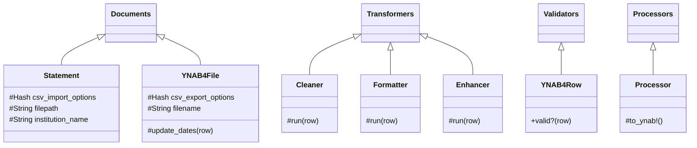

# YnabConvert

Convert CSV files from online banking to a [format YNAB 4 can consume](https://docs.youneedabudget.com/article/921-formatting-csv-file).

## Installation

    $ gem install ynab_convert

## Usage

```shell
$ ynab_convert -f my_transactions.csv -i example
```

This will process the file `my_transactions.csv` downloaded from Example Bank's
online banking platform, using the `example` processor (see list of available
processors below.)

It will then output the converted file as
`my_transactions_example_bank_20191101-2019-1201_ynab4.csv`. The dates in the
filename match the interval of the transactions found in the original CSV file.
In that case, the earliest transaction recorded happened on 2019-11-01 and the
latest one on 2019-12-01.

## Available processors

`-i` argument | Institution's full name | Institution's website | Remarks
---|---|---|---
`example` | Example Bank | N/A | Reference processor implementation, not a real institution
`n26` | N26 | [n26.com](n26.com) | N26 CSV statements, will convert EUR amounts to CHF (hardcoded for now)
`revolut` | Revolut Ltd | [revolut.com](https://www.revolut.com/) | The processor isn't aware of currencies. Make sure the statements processed with `revolut` are in the same currency that your YNAB is in
`ubs_chequing` | UBS Switzerland (private banking) | [ubs.ch](https://ubs.ch) | Private chequing and joint accounts
`ubs_credit` | UBS Switzerland (credit cards) | [ubs.ch](https://ubs.ch) | Both MasterCard and Visa

## Contributing

After checking out the repo, run `bin/setup` to install dependencies. Then, run
`rake spec` to run the tests. You can also run `bin/console` for an interactive
prompt that will allow you to experiment. To run Rubocop and RSpec in watch
mode, use `bundle exec guard`.

To install this gem onto your local machine, run `bundle exec rake install`.
Alternatively, the gem can also be run from `bin/ynab_convert`.

Bug reports and pull requests are welcome on GitHub at
https://github.com/coaxial/ynab_convert.

### Architecture

Here is the class diagram:


Each financial institution gets its own class for most of these base classes.

For instance, adding "Some Bank" would require creating the following new
classes:

- `class Processors::SomeBank < Processor`
- `class Transformers::Cleaners::SomeBank < Cleaner`
- `class Transformers::Formatter::SomeBank < Formatter`
- `class Transformers::Enhancer::SomeBank < Enhancer`
- `class Documents::Statements::SomeBank < Statement`

Each of these classes would implement the expected interface for its type, and
the `Processor::SomeBank` would instantiate them all. `Validators` and `YNAB4File`
aren't related to a particular institution, there is no need to derive a child
class for each bank.

Note that any of the `Transformers::` classes are optional, and it is possible
that some institution only requires a `Cleaner` but no `Formatter` or
`Enhancer` (for example).

### Debugging

Run `ynab_convert` with `YNAB_CONVERT_DEBUG=true`, or use the rake task
`spec:debug`. Debug logging goes to STDERR.

Or add `byebug` or `pry` statements in the code (works with guard and with rspec).

### Adding a new financial institution

If there is no processor for your financial institution, you can contribute one
to the project.

There is a commented example processor located at
`lib/ynab_convert/processors/example_processor.rb`. Looking at the other,
real-world processors in that directory can also help.

Be sure to add tests to your processor as well before you make a PR.

## License

The gem is available as open source under the terms of the [MIT
License](https://opensource.org/licenses/MIT).

(c) coaxial 2019
